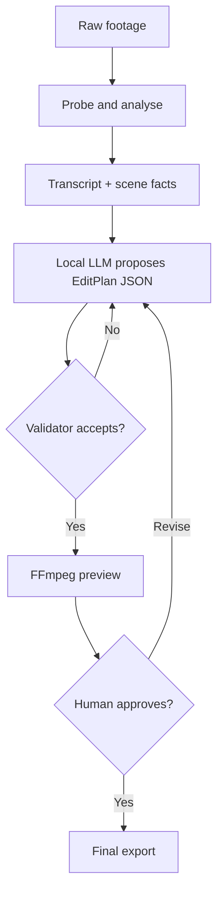

# Video Edit Automation

A local-first backend that turns raw footage plus a plain-language brief into a **reviewable edit plan**, then renders that plan with deterministic media tools.

The first product target is intentionally narrow: talking-head content plus evidence-driven gaming
highlights. It is not trying to replace Final Cut Pro or DaVinci Resolve. A local model or a
deterministic signal scorer decides *what* may be worth keeping; validated code decides *whether the
timeline is legal*; FFmpeg performs the actual edit.

## Current foundation

This initial scaffold provides:

- a localhost-only FastAPI service;
- durable project, asset, plan, and job metadata in SQLite;
- safe local-path imports restricted to configured media folders;
- `ffprobe` metadata extraction;
- a typed `EditPlan` contract with time-bound validation;
- an optional OpenAI-compatible local planner for LM Studio or Ollama;
- independent editing profiles and FPS/MOBA game profiles;
- typed highlight signals with deterministic weighting, buffering, merging, and evidence links;
- capture-neutral session manifests for OBS, ScreenCaptureKit, Windows Graphics Capture, and
  externally recorded files;
- deterministic League of Legends recognition from supplied process/window observations;
- automatic League VOD candidate discovery from audio peaks and focused local HUD OCR;
- persisted, typed gaming-analysis JSON plus one-call evidence-linked highlight-plan creation;
- durable highlight-review sessions with accept, reject, boundary-adjustment, missed-event labels,
  and deterministic evaluation metrics;
- a bounded editor/reviewer workflow that renders previews, samples evidence frames, applies only
  typed evidence-linked corrections, and stops after two review rounds by default;
- durable human-review state that versions timeline revisions, binds approval to one exact plan
  version, and gates every final render;
- project-scoped source playback and safe browser playback for backend-owned preview jobs, plus
  configurable localhost dashboard CORS;
- managed H.264/AAC browser-preview proxies for MKV and incompatible recordings, with range
  requests, duplicate-job protection, and restart-safe status;
- an integrated gaming review console with whole-source/current-cut/reel previews, evidence seeking,
  trim history, versioned approval, and final-output delivery actions;
- separate Manual and Automation first-cut workflows, plus a saved optional AI-review setting;
- clock-synchronized manual bookmarks that can directly create a MOBA highlight plan;
- a Windows OBS companion plus Mac SMB/local inbox monitor with READY, checksum, idempotency, and
  reconnect-safe ingestion;
- audio-track roles plus safe game-only rendering when game and microphone tracks are separate;
- configurable dip-to-black video and audio transitions at every selected highlight cut;
- dry-run FFmpeg command generation and background preview/final rendering;
- a sandboxed macOS desktop application with a compiled local API, packaged dashboard, dependency
  diagnostics, and ad-hoc-signed `.app`/`.dmg` output;
- unit and media integration tests.

Live OS capture, League telemetry, automatic FPS detectors, transcription, captions, and
multi-category runtime recipes are later vertical slices. See the
[cross-device OBS guide](docs/CROSS_DEVICE_OBS.md),
[vibe-coding plan](docs/VIBE_CODING_PLAN.md), and
[gaming architecture](docs/GAMING_ARCHITECTURE.md).

## Why this shape



The LLM never writes shell commands, arbitrary FFmpeg filters, or source-file paths. It only fills a schema using known asset IDs and timestamps. This boundary is the most important part of the system.

## Quick start

Prerequisites: Python 3.12+, Node.js 22+, [`uv`](https://docs.astral.sh/uv/), and FFmpeg/ffprobe.
Tesseract is required for the deterministic League kill/teamfight workflow. Manual selection,
review, approval, and rendering continue without it.

On a future Mac:

```bash
brew install ffmpeg tesseract uv
cp .env.example .env
uv sync --extra dev
uv run uvicorn video_edit_automation.main:app --reload --host 127.0.0.1 --port 8765
```

Then open `http://127.0.0.1:8765/docs` for the interactive API.

To run the backend and review console together:

```bash
npm --prefix frontend ci
uv run python scripts/export_openapi.py
npm --prefix frontend run api:generate
./scripts/dev-dashboard.sh
```

Open `http://127.0.0.1:4173`. The dashboard connects only to the localhost API. Agent 2 remains
optional; deterministic analysis, manual review, exact-version approval, and rendering work without
a configured reviewer model.

To run the Batch 3 desktop application in development:

```bash
npm --prefix desktop ci
npm --prefix desktop start
```

The Electron shell starts and health-checks both local processes, connects the dashboard
automatically, provides native video-folder and recording pickers, and reveals completed output in
Finder.

To create the ad-hoc-signed, non-notarized macOS app and DMG:

```bash
uv sync --extra dev --extra packaging
npm --prefix desktop run dist
```

The packaged app contains its own dashboard and compiled Python API. Batch 3 still uses system
FFmpeg/ffprobe and optional Tesseract; the in-app system check reports their availability. Bundled
media tools, signing, notarization, updates, and clean-Mac release qualification remain Batch 4.

Run the checks:

```bash
uv run ruff check .
uv run pytest
```

## First useful workflow

1. Create a new clips project or reopen an existing video folder.
2. Enter the editor, then add one or more `.mov`, `.mp4`, `.mkv`, or other supported recordings.
3. Choose Manual to scrub the recording, mark promising plays, include the ones you want, and trim
   their exact ranges before export. Or choose Kill & teamfight detection to find visible League
   kill announcements with local Tesseract and merge nearby kills. AI review is a separate setting.
4. In Manual mode, choose one combined video, separate clip files, or both. In Automation, inspect
   the evidence, preview, and approve the detected plan.
5. Render locally. Nothing is uploaded or published.

For gameplay, import a full-session recording and assign separate game/microphone track roles.
Manual first cuts create durable manual-marker evidence but skip the redundant second approval
because every exact range was already reviewed while trimming. Deterministic automation reads visible
League kill and multikill announcements with Tesseract and merges nearby kills into teamfight
clips; it does not interpret free-form instructions or call an LLM. See the gaming architecture for
the request shape and known OCR limits.

On Windows, the companion can now discover stable OBS recordings, package them into a shared Ready
folder, and let the Mac inbox automatically verify, copy, probe, and register the League session.
Game audio and microphone should remain on separate tracks. League OCR analysis is now available
after ingestion; automatically triggering analysis and rendering for every READY package remains a
later milestone.

Each automatic League plan returns a `review_session`. Its evidence and candidates survive a
restart, and review decisions can be submitted incrementally through the highlight-review API.
When a multimodal reviewer is configured, a bounded agent workflow can render the current plan,
sample representative preview frames, request an independent typed verdict, create a new validated
plan from supported corrections, and repeat once. Metrics remain provisional until every proposed
candidate has an accept, reject, or adjust decision. YouTube publishing and deletion remain absent.

For automatic plans, human approval is a separate authority boundary. A browser revision submits a complete typed plan,
creates a validated version, and clears any earlier approval. Final rendering is rejected unless the
exact current plan ID and version have active human approval; Agent 2 approval alone is insufficient.

When a source is not directly browser-compatible, the backend creates one managed MP4 proxy under
that project's `proxies/` directory. The original remains the analysis and final-render source.
Proxy and render metadata are durable; refresh restores completed and active work, while an
application restart marks interrupted work failed with an explicit retry path.

Manual imports reference source media in place. Capture-inbox imports are copied and checksum
verified into the Mac's project workspace before editing. Source files are never overwritten.
Creating a desktop project creates `Desktop/Cutroom Projects/<project name>` and enters the editor
immediately, even before a recording exists. Finished MP4 files are written to its visible
`Exports` folder. The editor then
shows a dedicated recording action and supports adding more recordings later. On desktop, reopening
a video folder uses Finder and remembers the Cutroom project linked to that folder on the same Mac.

## Local AI on the Mac

The design keeps model choices replaceable:

- **Speech-to-text:** add `whisper.cpp` first; it is offline and optimized for Apple Silicon.
- **Edit planner:** connect LM Studio or Ollama through the same OpenAI-compatible adapter.
- **Highlight reviewer:** point `VEA_REVIEWER_MODEL` at a multimodal OpenAI-compatible model. The
  same Qwen instance can serve editor and reviewer calls sequentially, but each call gets a fresh
  role-specific context.
- **Starting model size:** a good 7B-14B instruct model is enough for structured selection from a transcript. Bigger is not automatically better for frame-accurate editing.
- **Hardware:** the backend works on a 48 GB MacBook Pro, while the previously preferred 64 GB Mac setup gives more room to run transcription, an LLM, proxies, and the API together.

The media pipeline and LLM can also live on separate machines later: keep this Mac app as the controller and point the model adapter at a private local-network API.

## Repository guide

- [Architecture and contracts](docs/ARCHITECTURE.md)
- [Windows OBS to Mac automation](docs/CROSS_DEVICE_OBS.md)
- [Gaming capture, signals, profiles, and audio](docs/GAMING_ARCHITECTURE.md)
- [Vibe-coding roadmap and prompts](docs/VIBE_CODING_PLAN.md)
- [Project coding guardrails](AGENTS.md)
- `src/video_edit_automation/domain/` — stable data contracts and validation results
- `src/video_edit_automation/application/` — use cases and ports
- `src/video_edit_automation/infrastructure/` — FFmpeg, SQLite, paths, and local LLM adapters
- `src/video_edit_automation/api/` — HTTP boundary only
- `frontend/` — local gaming review console and generated API types
- `desktop/` — sandboxed Electron lifecycle and native bridge
- `scripts/dev-dashboard.sh` — one-command local frontend/backend startup

## Non-goals for the first release

- generative video or image creation;
- autonomous publishing to YouTube/TikTok;
- direct control of Final Cut, Premiere, or DaVinci;
- multi-user cloud hosting;
- training a custom video model;
- deleting or overwriting original footage.
