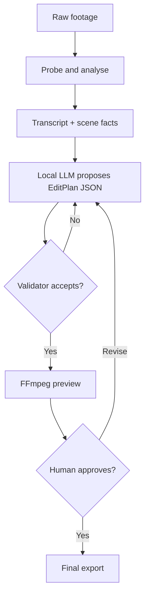

# Video Edit Automation

A local-first backend that turns raw footage plus a plain-language brief into a **reviewable edit plan**, then renders that plan with deterministic media tools.

The first product target is intentionally narrow: talking-head videos, lectures, interviews, and short-form clips. It is not trying to replace Final Cut Pro or DaVinci Resolve. The local LLM decides *what* may be worth keeping; validated code decides *whether the timeline is legal*; FFmpeg performs the actual edit.

## Current foundation

This initial scaffold provides:

- a localhost-only FastAPI service;
- durable project, asset, plan, and job metadata in SQLite;
- safe local-path imports restricted to configured media folders;
- `ffprobe` metadata extraction;
- a typed `EditPlan` contract with time-bound validation;
- an optional OpenAI-compatible local planner for LM Studio or Ollama;
- dry-run FFmpeg command generation and background preview/final rendering;
- unit and media integration tests.

Transcription, silence/scene analysis, captions, and a timeline UI are the next vertical slices. See [the vibe-coding plan](docs/VIBE_CODING_PLAN.md).

## Why this shape



The LLM never writes shell commands, arbitrary FFmpeg filters, or source-file paths. It only fills a schema using known asset IDs and timestamps. This boundary is the most important part of the system.

## Quick start

Prerequisites: Python 3.12+, [`uv`](https://docs.astral.sh/uv/), and FFmpeg/ffprobe.

On a future Mac:

```bash
brew install ffmpeg uv
cp .env.example .env
uv sync --extra dev
uv run uvicorn video_edit_automation.main:app --reload --host 127.0.0.1 --port 8765
```

Then open `http://127.0.0.1:8765/docs` for the interactive API.

Run the checks:

```bash
uv run ruff check .
uv run pytest
```

## First useful workflow

1. Create a project.
2. Import a `.mov` or `.mp4` by local path.
3. Create a manual plan, or supply transcript segments and ask a configured local LLM for one.
4. Inspect the validation report and dry-run command.
5. render a low-resolution preview.
6. Accept or revise the plan, then request the final render.

The API currently references source media rather than copying gigabytes into the project directory. Generated files always go under the tool's own data directory, and source files are never overwritten.

## Local AI on the Mac

The design keeps model choices replaceable:

- **Speech-to-text:** add `whisper.cpp` first; it is offline and optimized for Apple Silicon.
- **Edit planner:** connect LM Studio or Ollama through the same OpenAI-compatible adapter.
- **Starting model size:** a good 7B-14B instruct model is enough for structured selection from a transcript. Bigger is not automatically better for frame-accurate editing.
- **Hardware:** the backend works on a 48 GB MacBook Pro, while the previously preferred 64 GB Mac setup gives more room to run transcription, an LLM, proxies, and the API together.

The media pipeline and LLM can also live on separate machines later: keep this Mac app as the controller and point the model adapter at a private local-network API.

## Repository guide

- [Architecture and contracts](docs/ARCHITECTURE.md)
- [Vibe-coding roadmap and prompts](docs/VIBE_CODING_PLAN.md)
- [Project coding guardrails](AGENTS.md)
- `src/video_edit_automation/domain/` — stable data contracts and validation results
- `src/video_edit_automation/application/` — use cases and ports
- `src/video_edit_automation/infrastructure/` — FFmpeg, SQLite, paths, and local LLM adapters
- `src/video_edit_automation/api/` — HTTP boundary only

## Non-goals for the first release

- generative video or image creation;
- autonomous publishing to YouTube/TikTok;
- direct control of Final Cut, Premiere, or DaVinci;
- multi-user cloud hosting;
- training a custom video model;
- deleting or overwriting original footage.

