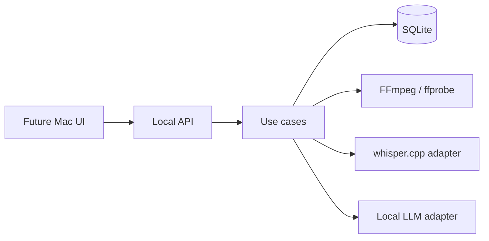
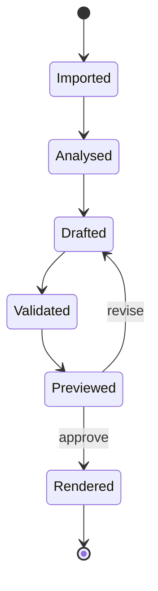

# Backend architecture

## Product decision

The MVP is a **local editing copilot for spoken content and evidence-driven gaming highlights**. It
converts factual analysis (duration, transcript, silence, scenes, or gaming signals) into a
versioned edit-decision plan. A human can preview and revise that plan before a deterministic
renderer produces the final file.

This is a better first project than a broad "AI video editor": it can become useful after a few
milestones, it is testable without subjective computer vision, and it showcases data engineering,
LLM integration, validation, APIs, and media processing.

## System boundary



The default server address is `127.0.0.1`. No authentication is included because the service is
not intended to be exposed outside the machine yet.

## Dependency rule

| Layer | Owns | May depend on |
|---|---|---|
| `domain` | IDs, projects, assets, transcripts, edit plans, jobs | Pydantic and standard library |
| `application` | create/import/plan/render use cases and ports | domain |
| `infrastructure` | SQLite, FFmpeg, path policy, local LLM HTTP | application + domain |
| `api` | request/response mapping and HTTP status codes | application + domain |

Adapters can change without rewriting the plan validator. For example, `whisper.cpp` can later be
replaced by MLX Whisper, or LM Studio by Ollama, while the application still consumes the same
transcript and plan contracts.

Gaming uses the same dependency rule: game recognition and signal analysers sit behind application
ports; genre/game weights are data profiles; all selected clips become ordinary validated timeline
segments. See [Gaming capture and highlight architecture](GAMING_ARCHITECTURE.md).

## Core contracts

### Media facts

`MediaAsset` records a stable asset ID, resolved source path, duration, dimensions, frame rate,
audio presence and stream roles, file size, and modification time. User prompts and model outputs
refer to the ID, not to filesystem paths.

### Transcript facts

`TranscriptSegment` contains `start_seconds`, `end_seconds`, and text, with optional confidence
and speaker. The timestamps remain in source-media time.

### Edit decision

An `EditPlan` contains ordered `TimelineSegment` values:

```json
{
  "asset_id": "uuid-from-the-repository",
  "source_in_seconds": 12.4,
  "source_out_seconds": 19.8,
  "purpose": "Concise explanation of the main result"
}
```

The timeline is sequential in v1, so a segment's output position is the sum of earlier segment
durations. Transitions, overlays, B-roll tracks, and keyframes must be added as new typed fields,
not as raw FFmpeg syntax.

### Validation

Rendering is blocked when:

- an asset is unknown or belongs to another project;
- an in/out time is negative, reversed, or exceeds real media duration;
- a segment is too short to render reliably;
- the plan has no segments;
- an asset lacks video or, in the current renderer, audio.

Target duration mismatches are warnings because the user may intentionally accept them.

## Local workspace

```text
~/.video-edit-automation/
├── metadata.sqlite3
└── projects/
    └── <project-id>/
        ├── analysis/
        ├── proxies/
        ├── renders/
        │   ├── previews/
        │   └── final/
        └── logs/
```

Source footage stays where the user put it. A later "managed import" mode may copy or hard-link it,
but must remain explicit because video files are large.

## Pipeline states



Metadata is durable. Render jobs are executed by FastAPI background tasks in the MVP, so jobs that
were running during a process crash must be marked failed on startup. A durable worker is justified
only after real usage shows the need; Redis/Celery would add deployment weight too early.

## Model responsibilities

The local model may:

- rank transcript moments against a brief;
- choose segments from known timestamps;
- explain why each segment is selected;
- propose a title, summary, and caption wording.

The local model may not:

- read arbitrary files;
- invent asset IDs or times outside supplied evidence;
- execute tools directly;
- produce shell commands or filtergraphs;
- choose output paths;
- publish content.

Structured output is still untrusted input. Pydantic parsing is followed by repository-aware plan
validation.

Gaming highlight scoring does not require an LLM. Typed game, telemetry, OCR, audio, motion,
microphone-reaction, scene-change, and manual signals feed a deterministic scorer. A model may later
rerank validated candidates or explain a plan, but it must not invent unsupported event evidence.

## Scaling later

Keep a narrow model-provider interface. On one Mac, all adapters use localhost. If heavier models
move to a Linux/NVIDIA server later, only the private API base URL changes. Media rendering should
stay close to the source footage unless a deliberate transfer/cache layer is added.
