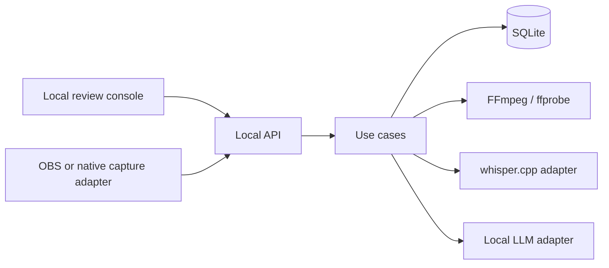
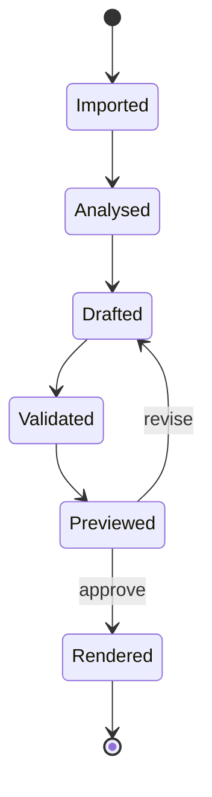

# Backend architecture

## Product decision

The MVP is a **local editing copilot for spoken content and evidence-driven gaming highlights**. It
converts factual analysis (duration, transcript, silence, scenes, or gaming signals) into a
versioned edit-decision plan. A human can preview and revise that plan before a deterministic
renderer produces the final file.

This is a better first project than a broad "AI video editor": it can become useful after a few
milestones, it is testable without subjective computer vision, and it showcases data engineering,
LLM integration, validation, APIs, and media processing.

## System boundary



The default server address is `127.0.0.1`. No authentication is included because the service is
not intended to be exposed outside the machine yet.

The console is stored under `frontend/` and consumes types generated from FastAPI's OpenAPI schema.
It may seek project-owned source or rendered media only through ID-based API routes. It never
receives authority to choose source paths, render paths, FFmpeg arguments, publishing actions, or
deletion actions.

## Dependency rule

| Layer | Owns | May depend on |
|---|---|---|
| `domain` | IDs, projects, assets, transcripts, edit plans, jobs | Pydantic and standard library |
| `application` | create/import/plan/render use cases and ports | domain |
| `infrastructure` | SQLite, FFmpeg, path policy, local LLM HTTP | application + domain |
| `api` | request/response mapping and HTTP status codes | application + domain |

Adapters can change without rewriting the plan validator. For example, `whisper.cpp` can later be
replaced by MLX Whisper, or LM Studio by Ollama, while the application still consumes the same
transcript and plan contracts.

Gaming uses the same dependency rule: game recognition and signal analysers sit behind application
ports; genre/game weights are data profiles; all selected clips become ordinary validated timeline
segments. See [Gaming capture and highlight architecture](GAMING_ARCHITECTURE.md).

Capture is an input boundary, not a platform assumption. OBS on Windows/macOS, a future
Windows.Graphics.Capture helper, and a future ScreenCaptureKit helper all register the same typed
capture-session manifest after the media file is safely imported.

## Core contracts

### Media facts

`MediaAsset` records a stable asset ID, resolved source path, duration, dimensions, frame rate,
audio presence and stream roles, file size, and modification time. User prompts and model outputs
refer to the ID, not to filesystem paths.

### Transcript facts

`TranscriptSegment` contains `start_seconds`, `end_seconds`, and text, with optional confidence
and speaker. The timestamps remain in source-media time.

### Edit decision

An `EditPlan` contains ordered `TimelineSegment` values:

```json
{
  "asset_id": "uuid-from-the-repository",
  "source_in_seconds": 12.4,
  "source_out_seconds": 19.8,
  "purpose": "Concise explanation of the main result"
}
```

The timeline is sequential in v1, so a segment's output position is the sum of earlier segment
durations. Transitions, overlays, B-roll tracks, and keyframes must be added as new typed fields,
not as raw FFmpeg syntax.

### Validation

Rendering is blocked when:

- an asset is unknown or belongs to another project;
- an in/out time is negative, reversed, or exceeds real media duration;
- a segment is too short to render reliably;
- the plan has no segments;
- an asset lacks video or, in the current renderer, audio.

Target duration mismatches are warnings because the user may intentionally accept them.

### Gaming review evidence

Every automatic gaming analysis has a unique ID and immutable JSON artifact. Creating its edit plan
also creates a durable `HighlightReviewSession` containing the exact source fingerprint, analyzer,
game profile, detected signals, selected candidates, and plan ID. Review decisions are append-only:
later decisions for the same candidate create a new revision rather than rewriting earlier labels.

The current review contract supports accept, reject, adjusted boundaries, and explicitly missed
events. Deterministic code calculates candidate precision/recall/F1, pending review count, accepted
duration, boundary correction, correction rate, and missed-event counts. These are candidate-level
selection metrics; detector-specific event precision requires a later signal-labelling extension.

### Bounded reviewer workflow

`HighlightAgentWorkflow` links one evidence review session to an immutable sequence of preview
render jobs, reviewer verdicts, and validated plan versions. The reviewer may return only a typed
`HighlightReviewerVerdict`: approve, require a human, or request `adjust`, `remove`, or `add`
corrections. Deterministic application code rejects unknown segment references, invented signal
IDs, out-of-duration ranges, overlaps, evidence-free additions or adjustments, repeated segment
corrections, and no-op changes before asking `PlanService` to create a new version.

Each round renders to a unique preview job and must pass the renderer's decode/duration validation
before the reviewer receives bounded structured evidence and backend-extracted JPEG frames. A
request contains at most 50 clips, 200 signals, and 12 frames. Two automatic review rounds are the
default; another requested revision becomes `human_review_required`. Reviewer output cannot select
paths, build media commands, publish, or delete files.

### Version-bound human approval

`HighlightHumanReviewState` tracks the current plan for one gaming review session and retains its
approval history. A browser revision submits a complete typed `EditPlanDraft` together with the plan
ID it was based on. The application rejects stale revisions, validates the draft against real
source durations, creates a new plan version, and clears active approval.

Approval requires every proposed candidate to have a latest accept, adjust, or reject decision. It
records the exact plan ID and version. `RenderService` permits preview jobs without approval but
rejects final-render requests unless that exact plan/version remains active. Reviewer-agent approval
never satisfies this check.

Rendered media is exposed only by job ID. The API resolves the stored path again and requires it to
be an MP4 inside that project's managed render directory; clients cannot submit or retrieve an
arbitrary filesystem path.

Source preview is exposed only by a project-and-asset pair. The project service confirms ownership,
then re-applies either managed-import containment or configured media-root containment before
returning the file. The browser never supplies a source path to this read route.

### Browser playback proxies and durable jobs

An MP4 source with H.264 video and AAC/MP3 audio can be served directly. Other containers or codecs
use a durable `MediaProxy` record. Deterministic application code—not the browser or a model—chooses
an output inside the project's `proxies/` directory and invokes FFmpeg with an argument list to
create H.264/AAC media with fast-start metadata. The original asset stays registered as the source
for analysis and final rendering.

Preparing the same asset fingerprint with the same proxy settings twice reuses the queued, running,
or completed proxy. A changed source or width setting creates new managed work. Render requests
likewise reuse an identical plan/preset job while its managed output remains valid. Project-scoped
playback and render routes support byte ranges for seeking but never accept an output path from the
client.

Proxy and render jobs are persisted before execution. On process startup, any queued or running
record left by the previous process is marked failed with a recoverable explanation; it is never
reported as indefinitely active. Project job listing lets the dashboard restore active render
progress, the latest preview, and final output after refresh or restart.

### Dashboard state

The workflow stepper is derived from durable backend facts and local unsaved state. Export is not
complete until a final render succeeds. A trim draft or changed candidate decision returns the UI to
review, blocks approval/rendering, and requires a new validated plan version before human approval.
Agent 2 is optional and its approval is displayed separately from version-bound human approval.

Desktop entry presents two mutually exclusive actions: create a new managed clips project or open
an existing video folder through Finder. Either action enters the editing room immediately.
Recording import belongs to the project workspace, where an empty project clearly asks for its
first recording and an active project can add further recordings.

The user chooses a first-cut workflow independently from AI assistance. Manual converts exact
human-selected ranges into `manual_marker` signals, a typed analysis, a validated plan, and a
normal highlight-review session. Automation is intentionally limited to visible League champion
kills, multikills, and kill clusters that represent teamfights; it does not accept free-form text
or call an LLM. Tesseract supplies those HUD events, and plans reject audio-, objective-, or
result-only evidence. AI Review may run the bounded Agent 2 contract after a preview exists. Full
local-model planning remains a later, explicitly unavailable setting.

### Desktop application boundary

The Batch 3 desktop shell owns process lifecycle and narrowly scoped OS integration. Electron starts
the localhost API on an available port, passes desktop-owned configuration through explicit
environment values, waits for `/healthz`, starts the dashboard, and shuts both processes down with
the application. The desktop renderer is sandboxed with context isolation and no Node.js access.

The preload bridge exposes only typed native actions. The video-folder and recording pickers return
real paths only when they remain inside the same configured media-root policy used by the backend.
A locally saved folder-to-project association lets Finder reopen the appropriate Cutroom project;
it does not move or rewrite media. Finder reveal is limited to an existing MP4 under the desktop
application's managed `projects/` workspace. The web dashboard cannot execute commands, select
output paths, broaden filesystem roots, or reveal an arbitrary local path.

Desktop bootstrap never restores a project through the dashboard's old default port. The renderer
first adopts the dynamic API address supplied by Electron, then waits for an explicit new/open
choice. Unreachable loopback requests are reported as a recoverable local-connection problem rather
than exposing the browser's generic `Failed to fetch` message.

Development launches Python and the dashboard from the repository. Packaged mode instead starts a
single-file Python sidecar plus the production dashboard worker and static assets from read-only
application resources. Both servers bind only to loopback. The backend diagnostic contract reports
database and workspace health, free space, and the installed versions of FFmpeg, ffprobe, and
optional Tesseract.

The ad-hoc-signed, non-notarized Batch 3 `.app` and `.dmg` still rely on system FFmpeg/ffprobe for
analysis and rendering. Bundled media tools and licence attribution, Developer ID signing,
notarization, update delivery, and clean-Mac release qualification belong to Batch 4.

## Local workspace

```text
~/.video-edit-automation/
├── metadata.sqlite3
└── projects/
    └── <project-id>/
        ├── analysis/
        ├── imports/
        ├── proxies/
        ├── renders/
        │   ├── previews/
        │   └── final/
        └── logs/
```

Manual source footage stays where the user put it. READY capture-inbox packages use managed import:
the recording is copied into `imports/`, verified against manifest size and SHA-256, then registered.
This keeps rendering off an unreliable SMB connection without deleting or overwriting the source.

## Pipeline states



Metadata is durable. Proxy and render jobs are executed by FastAPI background tasks in the MVP.
Jobs left queued or running by a stopped process are marked recoverably failed on startup. A
durable worker is justified only after real usage shows the need; Redis/Celery would add deployment
weight too early.

## Model responsibilities

The local model may:

- rank transcript moments against a brief;
- choose segments from known timestamps;
- explain why each segment is selected;
- propose a title, summary, and caption wording;
- return a typed highlight-review verdict against supplied segment and signal IDs.

The local model may not:

- read arbitrary files;
- invent asset IDs or times outside supplied evidence;
- execute tools directly;
- produce shell commands or filtergraphs;
- choose output paths;
- publish content.

Structured output is still untrusted input. Pydantic parsing is followed by repository-aware plan
validation. The only model-originated domain outputs currently accepted are `EditPlanDraft` and
`HighlightReviewerVerdict`; neither contract contains paths, commands, publishing actions,
credentials, or cleanup instructions.

Gaming highlight scoring does not require an LLM. Typed game, telemetry, OCR, audio, motion,
microphone-reaction, scene-change, and manual signals feed a deterministic scorer. A configured
multimodal model may independently review validated candidates and preview frames, but it must not
invent unsupported event evidence.

The first automatic gaming adapter, `league-ocr-audio-v1`, uses FFmpeg to scan audio and sample a
bounded set of candidate HUD frames, then requires local Tesseract for OCR. Its typed
`HighlightAnalysis` is atomically saved under the project's `analysis/` directory before
kill-related signals reach the common scorer. The analyzer never chooses paths, cuts, or FFmpeg
syntax, and it can later be replaced by a local vision model behind the same
`HighlightSignalAnalyzer` port.

## Scaling later

Keep a narrow model-provider interface. On one Mac, all adapters use localhost. If heavier models
move to a Linux/NVIDIA server later, only the private API base URL changes. Media rendering should
stay close to the source footage unless a deliberate transfer/cache layer is added.
