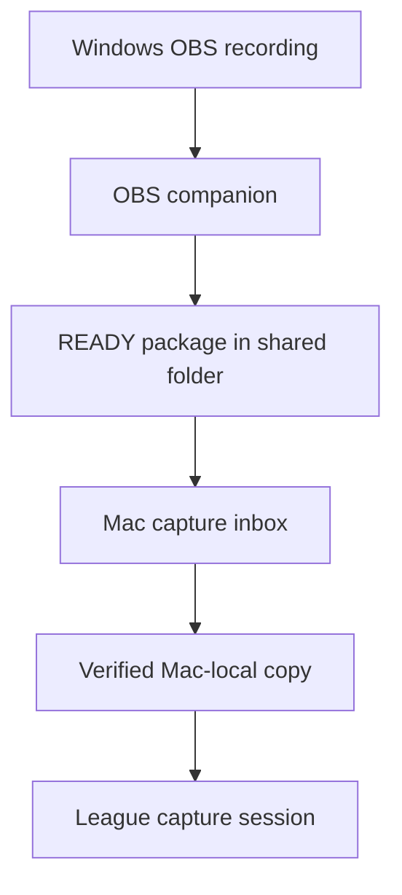

# Windows OBS to Mac automation

## What this milestone automates

A lightweight companion runs beside OBS on the Windows gaming PC. It waits until a recording has
stopped changing, copies it into a completed package, calculates SHA-256 while copying, writes a
typed `session.json`, and creates `READY` last. The Mac backend polls one or more mounted SMB/local
inboxes, verifies and copies READY recordings into Mac-local project storage, probes the media, and
registers the capture session exactly once.



This does not control OBS, detect League events, or start an edit automatically. It completes the
cross-device discovery and transfer boundary on which those later signals depend.

## Folder layout

On Windows, keep active recording and completed packages separate:

```text
D:\OBS-Automation\
├── Recording\    # OBS writes here; do not share this folder
└── Ready\        # companion writes completed packages; share this over SMB
```

Record to a local SSD. Do not point OBS directly at an SMB path: a network interruption must not
damage or interrupt the source recording.

Share `Ready` as `OBS-Ready`. Keep Windows network discovery and file sharing limited to a private
LAN and use a password-protected account. See Microsoft's
[Windows network file-sharing guide](https://support.microsoft.com/en-us/windows/experience/connectivity-networking/file-sharing-over-a-network-in-windows).

## Create a project on the Mac

Start the Mac backend and create a project through `http://127.0.0.1:8765/docs` or the API. Copy the
returned project UUID; the Windows companion uses it to route recordings into the correct Mac
project.

## Run the Windows companion

Install/sync this repository on Windows, then run:

```powershell
uv run vea-obs-companion `
  --recordings-root "D:\OBS-Automation\Recording" `
  --drop-root "D:\OBS-Automation\Ready" `
  --project-id "PROJECT-UUID-FROM-THE-MAC" `
  --game-id "league_of_legends" `
  --process-name "League of Legends.exe" `
  --settle-seconds 30 `
  --poll-seconds 5
```

The companion is intentionally small and does not need the Mac's local LLM. Keep the terminal
running while recording. A later packaging milestone can install it as a Windows startup task or
standalone executable.

If stable OBS stream indexes are known, optional roles can be added:

```powershell
  --audio-role "1=game" --audio-role "2=microphone"
```

Do not guess these indexes. The Mac validates them against ffprobe metadata, and incorrect values
cause ingestion to fail visibly. OBS supports assigning sources to distinct tracks; see the
[official multiple-audio-track guide](https://obsproject.com/kb/multiple-audio-track-recording-guide).

## Mount the share on the Mac

In Finder, choose **Go → Connect to Server** and use either:

```text
smb://WINDOWS-PC/OBS-Ready
smb://192.168.1.50/OBS-Ready
```

Save the Windows account credentials in Keychain. Apple documents the same connection flow in
[Connect to a Windows computer from a Mac](https://support.apple.com/guide/mac-help/connect-to-a-windows-computer-from-a-mac-mchlp1660/mac).

The normal mounted path is:

```text
/Volumes/OBS-Ready
```

Configure the Mac backend:

```dotenv
VEA_CAPTURE_INBOX_ROOTS=["/Volumes/OBS-Ready"]
VEA_CAPTURE_INBOX_POLL_SECONDS=15
VEA_CAPTURE_INBOX_AUTO_SCAN=true
```

The monitor scans immediately at startup and then at the configured interval. If the SMB volume is
unmounted, the backend records it as unavailable and retries; other API functionality remains up.
The share must be mounted again by macOS before scanning can resume.

Inspect status or trigger a manual retry through:

```http
GET  /api/v1/capture-inbox/status
POST /api/v1/capture-inbox/scan
```

## READY package contract

Each completed directory contains:

```text
<session-uuid>/
├── recording.mkv
├── session.json
└── READY
```

`session.json` includes schema version, stable session/project IDs, expected recording size and
SHA-256, platform/recorder, optional process/window evidence, optional audio roles, and optional
bookmarks. The filename must be plain—absolute paths and traversal are rejected.

The session UUID is deterministic for the Windows source path, project, size, and modification
time. Re-scanning the same package therefore returns `already_ingested` instead of duplicating the
asset or session.

## Copy and failure behavior

- A folder without `READY` remains pending.
- The Mac copies to `<data-dir>/projects/<project-id>/imports/<session-id>.<ext>.partial`.
- Size and SHA-256 are verified during the copy.
- Only a verified file is atomically renamed to its final local name.
- A changed or corrupt transfer removes its partial file and is retried on a later scan.
- SMB disconnection is recoverable and does not crash the API.
- Source recordings and completed Windows packages are never deleted.

## Still to implement

- installing the Windows companion as a startup/background service;
- using OBS WebSocket events instead of only size/mtime stability;
- collecting League Live Client Data events and synchronized bookmarks on Windows;
- automatically creating and rendering a highlight plan after signals arrive;
- optionally returning finished renders to a Windows `Exports` share.

