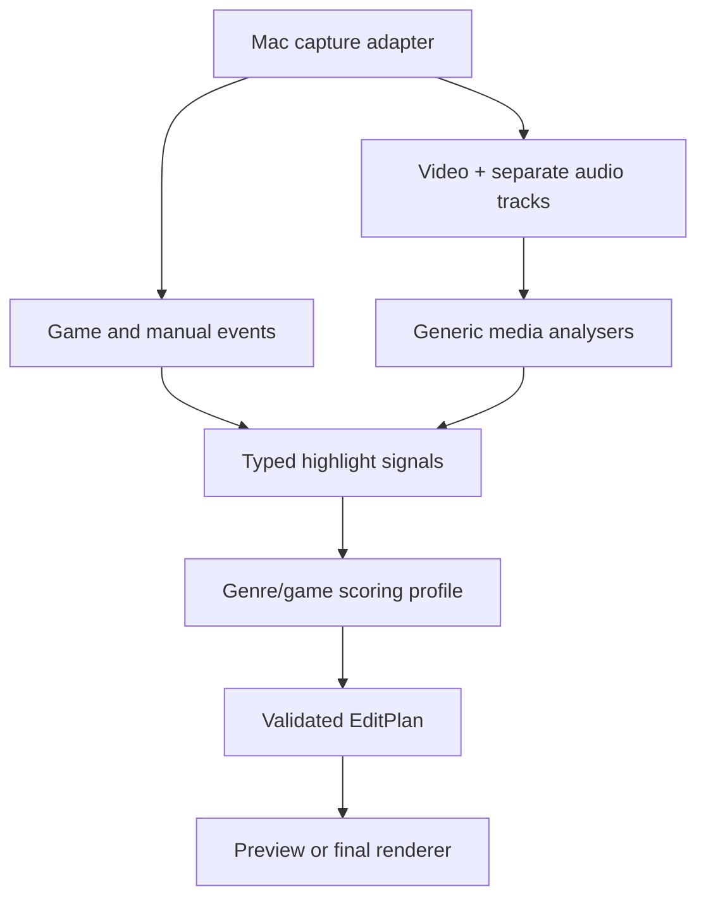

# Gaming capture and highlight architecture

## Product decision

Do not split spoken videos, FPS videos, and MOBA videos into separate backends. Keep one media,
timeline, validation, and render engine, then describe a gaming job along two independent axes:

| Axis | Examples | Controls |
|---|---|---|
| Editing profile | gameplay highlights, commentary, montage, short-form | pacing, duration, captions, layout |
| Game profile | generic FPS, generic MOBA, later a specific game | event weights, buffers, signal adapters |

This avoids duplicating import, storage, rendering, and review code. A specific-game adapter can
provide better evidence without changing the common `EditPlan` contract.

The current implementation borrows product concepts from Outplayed—capture modes, event markers,
pre/post buffers, a full-session timeline, and separate audio tracks—but uses open contracts and its
own deterministic scoring logic. It does not copy or depend on Outplayed's implementation.

## System shape



The Python backend owns projects, evidence, scoring, plans, validation, and FFmpeg rendering. A
future small Swift helper should own macOS screen/window capture. This keeps ScreenCaptureKit and
permission handling out of the portable editing domain.

## Capture modes

`GameProfile.capture_mode` supports four strategies:

- `highlights`: keep only buffered windows around detected events;
- `full_match`: keep the match and add event markers;
- `full_session`: record continuously and mark events for later editing;
- `manual`: capture or bookmark only when the user triggers it.

The initial FPS and MOBA profiles default to `full_session`. That is the safest first workflow:
capture everything once, then improve detection without risking a lost moment.

Capture is not implemented in the Python service yet. The next Mac adapter should use
ScreenCaptureKit, select a display/window or application, and emit a session manifest containing
the captured file, process/window observations, clock origin, and audio-track roles.

## Game recognition

Game recognition should be confidence-based and layered:

1. Match the foreground executable, bundle ID, and window title to a game registry.
2. If available, attach a specific-game telemetry, log, replay, or supported event adapter.
3. Use OCR to recognize stable HUD events such as victory, kill feed, objective, or scoreboard.
4. Add game-agnostic evidence: audio peaks, motion, scene changes, and microphone reactions.
5. Always retain a manual bookmark signal as a reliable fallback.

`GameDetector` and `HighlightSignalAnalyzer` are application ports for these adapters. A detected
game produces `DetectedGame(game_id, display_name, genre, confidence, evidence)`. The genre chooses
the baseline profile; a specific-game profile may override only the weights and compatible signal
sources.

Do not let recognition silently guess at low confidence. The UI should show the detected game and
let the user override it before analysis.

## Signal fusion

All detectors normalize their output to `HighlightSignal`:

```json
{
  "id": "event-123",
  "asset_id": "00000000-0000-0000-0000-000000000000",
  "timestamp_seconds": 215.4,
  "duration_seconds": 0,
  "signal_type": "game_event",
  "event_name": "multi_kill",
  "confidence": 0.92,
  "source": "example-game-adapter"
}
```

The deterministic baseline multiplies the matching profile weight by signal confidence, applies
pre/post-roll, merges overlapping or nearby windows, and ranks the result. Each timeline segment
retains `highlight_signal_ids`, so a reviewer can see why it was selected.

The built-in `generic_fps` and `generic_moba` weights are starting heuristics, not claims of
production detection accuracy. Calibrate them against real accepted/rejected clips per game.

## Audio policy

Capture game/system audio and microphone audio as separate tracks whenever both are enabled. The
microphone track can still produce a `microphone_reaction` signal even when the final render uses
only the game track. Analysis input and export audio are deliberately separate decisions.

After import, assign track roles if metadata did not identify them:

```http
PUT /api/v1/projects/{project_id}/assets/{asset_id}/audio-tracks
```

```json
{
  "assignments": [
    {"stream_index": 1, "role": "game"},
    {"stream_index": 2, "role": "microphone"}
  ]
}
```

Then request a game-only render with:

```json
{
  "preset": {
    "profile": "preview",
    "aspect_ratio": "source",
    "frames_per_second": 60,
    "audio_output_mode": "game_only"
  }
}
```

The renderer refuses `game_only` unless an individually addressable track has the `game` role. If
game and microphone were recorded into one mixed track, clean microphone removal is not reliable;
the tool must explain this rather than pretending it can isolate the game sound.

Voice chat may be a separate process or stream, depending on the game. Treat `voice_chat` as its
own role instead of assuming it is part of game audio.

## Current API workflow

1. Import full-session gameplay.
2. Inspect and, if necessary, assign audio-track roles.
3. Get `GET /api/v1/gaming/profiles` and choose `generic_fps` or `generic_moba`.
4. Supply normalized signals to `POST /api/v1/projects/{project_id}/gaming/highlight-plans`.
5. Review the evidence-linked plan and validation report.
6. Dry-run or render with `source_mix` or `game_only` audio.

The backend currently consumes signals; it does not yet watch a live game, record the screen, read
telemetry, or run OCR/audio/motion detectors. Those are adapters to add without changing the plan
or renderer.

## Delivery order

1. Build the Swift ScreenCaptureKit helper with separate game and microphone tracks.
2. Add a game registry plus foreground process/window detector.
3. Add manual bookmarks and clock-synchronized event ingestion.
4. Implement one specific FPS adapter and one specific MOBA adapter.
5. Add generic audio, microphone-reaction, motion, scene, and OCR analysers.
6. Create a labelled evaluation set and tune profiles using precision, recall, false highlights,
   missed highlights, and correction time.
7. Add a review UI that exposes evidence, score, and game/profile overrides.

## Reference behavior

- [Outplayed usage and capture/audio modes](https://support.overwolf.com/support/solutions/articles/9000208995-how-to-use-outplayed)
- [Overwolf game-event API overview](https://dev.overwolf.com/ow-native/reference/ow-sdk-introduction/)
- [Apple ScreenCaptureKit capture guidance](https://developer.apple.com/documentation/screencapturekit/capturing-screen-content-in-macos)

