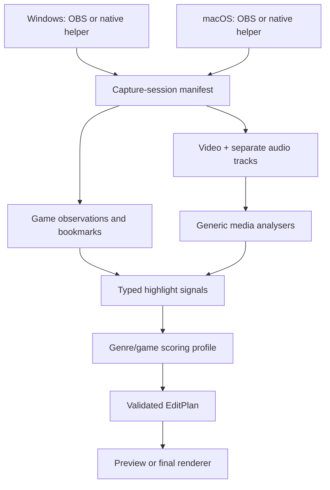

# Gaming capture and highlight architecture

## Product decision

Do not split spoken videos, FPS videos, and MOBA videos into separate backends. Keep one media,
timeline, validation, and render engine, then describe a gaming job along two independent axes:

| Axis | Examples | Controls |
|---|---|---|
| Editing profile | gameplay highlights, commentary, montage, short-form | pacing, duration, captions, layout |
| Game profile | generic FPS, generic MOBA, later a specific game | event weights, buffers, signal adapters |

This avoids duplicating import, storage, rendering, and review code. A specific-game adapter can
provide better evidence without changing the common `EditPlan` contract.

The current implementation borrows product concepts from Outplayed—capture modes, event markers,
pre/post buffers, a full-session timeline, and separate audio tracks—but uses open contracts and its
own deterministic scoring logic. It does not copy or depend on Outplayed's implementation.

## System shape



The Python backend owns projects, capture-session metadata, evidence, scoring, plans, validation,
and FFmpeg rendering. OS-specific capture and permissions remain outside the portable editing
domain. An OBS recording can be used now; future Windows and macOS helpers emit the same manifest.

## Capture modes

`GameProfile.capture_mode` supports four strategies:

- `highlights`: keep only buffered windows around detected events;
- `full_match`: keep the match and add event markers;
- `full_session`: record continuously and mark events for later editing;
- `manual`: capture or bookmark only when the user triggers it.

The initial FPS and MOBA profiles default to `full_session`. That is the safest first workflow:
capture everything once, then improve detection without risking a lost moment.

The backend now registers completed recordings as capture sessions. A manifest references an
already imported asset and records platform, recorder, process/window observations, optional
monotonic clock origin, detected game/profile, audio-track roles, and normalized signals. It does
not start or stop OBS and does not yet perform native live capture.

Supported recorder identities are `obs`, `screen_capture_kit`, `windows_graphics_capture`, and
`external`. Platform validation prevents a ScreenCaptureKit manifest from claiming Windows or a
Windows Graphics Capture manifest from claiming macOS.

### Windows and OBS workflow

OBS is the first practical Windows path. Configure Advanced Output and record sources on separate
tracks—for example track 1 mixed playback, track 2 game audio, and track 3 microphone—then import
the resulting recording and assign the actual stream indexes their roles. OBS officially supports
assigning sources to separate recording tracks.

The backend does not assume OBS track numbers because FFmpeg stream indexes depend on the file. It
probes the recording first and validates every supplied assignment.

## Game recognition

Game recognition should be confidence-based and layered:

1. Match the foreground executable, bundle ID, and window title to a game registry.
2. If available, attach a specific-game telemetry, log, replay, or supported event adapter.
3. Use OCR to recognize stable HUD events such as victory, kill feed, objective, or scoreboard.
4. Add game-agnostic evidence: audio peaks, motion, scene changes, and microphone reactions.
5. Always retain a manual bookmark signal as a reliable fallback.

`GameDetector` and `HighlightSignalAnalyzer` are application ports for these adapters. A detected
game produces `DetectedGame(game_id, display_name, genre, confidence, evidence)`. The genre chooses
the baseline profile; a specific-game profile may override only the weights and compatible signal
sources.

The built-in registry currently recognizes League of Legends from a supplied Windows process name
or matching window-title fragment and selects `generic_moba`. Process evidence has higher confidence
than title-only evidence, and an explicit user override is stored as such. Unknown observations
return no detection instead of being silently classified.

For later automatic League events, Riot's local Live Client Data API is a promising adapter input.
It is not called by the current backend and no network service is required for current tests.

Do not let recognition silently guess at low confidence. The UI should show the detected game and
let the user override it before analysis.

## Signal fusion

All detectors normalize their output to `HighlightSignal`:

```json
{
  "id": "event-123",
  "asset_id": "00000000-0000-0000-0000-000000000000",
  "timestamp_seconds": 215.4,
  "duration_seconds": 0,
  "signal_type": "game_event",
  "event_name": "multi_kill",
  "confidence": 0.92,
  "source": "example-game-adapter"
}
```

The deterministic baseline multiplies the matching profile weight by signal confidence, applies
pre/post-roll, merges overlapping or nearby windows, and ranks the result. Each timeline segment
retains `highlight_signal_ids`, so a reviewer can see why it was selected.

The built-in `generic_fps` and `generic_moba` weights are starting heuristics, not claims of
production detection accuracy. Calibrate them against real accepted/rejected clips per game.

## Audio policy

Capture game/system audio and microphone audio as separate tracks whenever both are enabled. The
microphone track can still produce a `microphone_reaction` signal even when the final render uses
only the game track. Analysis input and export audio are deliberately separate decisions.

After import, assign track roles if metadata did not identify them:

```http
PUT /api/v1/projects/{project_id}/assets/{asset_id}/audio-tracks
```

```json
{
  "assignments": [
    {"stream_index": 1, "role": "game"},
    {"stream_index": 2, "role": "microphone"}
  ]
}
```

Then request a game-only render with:

```json
{
  "preset": {
    "profile": "preview",
    "aspect_ratio": "source",
    "frames_per_second": 60,
    "audio_output_mode": "game_only"
  }
}
```

The renderer refuses `game_only` unless an individually addressable track has the `game` role. If
game and microphone were recorded into one mixed track, clean microphone removal is not reliable;
the tool must explain this rather than pretending it can isolate the game sound.

Voice chat may be a separate process or stream, depending on the game. Treat `voice_chat` as its
own role instead of assuming it is part of game audio.

## Current API workflow

1. Import full-session gameplay.
2. Inspect the probed audio streams.
3. Register `POST /api/v1/projects/{project_id}/capture-sessions` with platform, recorder,
   observations, clock origin, and audio roles.
4. Verify the result or use `POST /api/v1/gaming/detect-game` before registration.
5. Add timestamp- or monotonic-clock bookmarks through the session's `/bookmarks` endpoint.
6. Create a plan through the session's `/highlight-plans` endpoint.
7. Review the evidence-linked plan and render with `source_mix` or `game_only` audio.

The backend now persists capture sessions and manual signals. A Windows companion and Mac inbox can
automatically transfer and register completed OBS recordings. It does not control OBS, record the
screen, read League telemetry, or run OCR/audio/motion detectors. Those remain adapters that do not
change the session, plan, or renderer contracts.

## Delivery order

1. **Implemented:** shared session manifest, League registry detection, audio-role ingestion, and
   clock-synchronized manual bookmarks.
2. **Implemented:** Windows stable-file companion, READY/checksum package protocol, automatic Mac
   inbox polling, managed local copy, and idempotent ingestion.
3. Add a Windows foreground-process observer and League Live Client Data event collector; keep OBS
   as the recorder initially.
4. Add an optional Swift ScreenCaptureKit helper and, only if needed, a native Windows recorder.
5. Implement a League Live Client Data signal adapter and one specific FPS adapter.
6. Add generic audio, microphone-reaction, motion, scene, and OCR analysers.
7. Create a labelled evaluation set and tune profiles using precision, recall, false highlights,
   missed highlights, and correction time.
8. Add a review UI that exposes evidence, score, and game/profile overrides.

## Reference behavior

- [Outplayed usage and capture/audio modes](https://support.overwolf.com/support/solutions/articles/9000208995-how-to-use-outplayed)
- [Overwolf game-event API overview](https://dev.overwolf.com/ow-native/reference/ow-sdk-introduction/)
- [OBS multiple audio-track recording guide](https://obsproject.com/kb/multiple-audio-track-recording-guide)
- [Microsoft Windows.Graphics.Capture](https://learn.microsoft.com/en-us/windows/apps/develop/media-authoring-processing/screen-capture)
- [Apple ScreenCaptureKit capture guidance](https://developer.apple.com/documentation/screencapturekit/capturing-screen-content-in-macos)
- [Riot League Live Client Data API](https://developer.riotgames.com/docs/lol)
